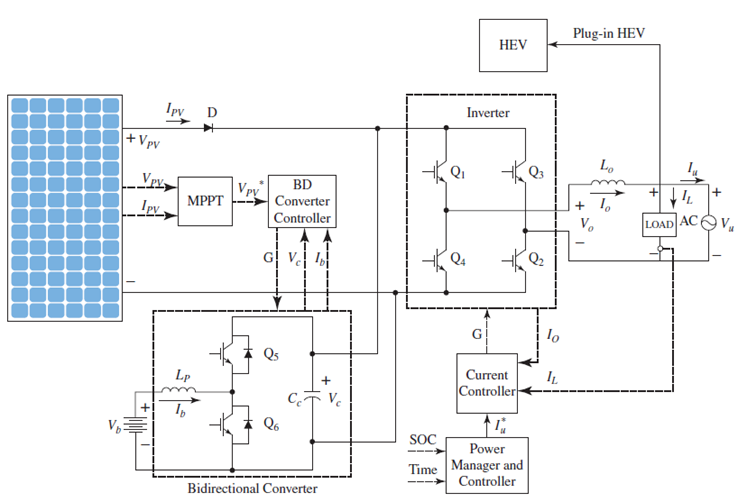

# Power Electronics Project Documentation: A Brief Discussion about the applications of Power Electronics in Photovoltaic Systems

# **Preface:**

I implemented this project as part of the Power Electronics Course (ELCT 704) at the **G**erman **U**niversity in **C**airo (**GUC)**. The course was taught by Prof. [Walid Omran](https://www.linkedin.com/in/walid-omran-4679154/) and [Mohamed Farag Ibrahim](https://www.linkedin.com/in/mohamed-ibrahim-67a40119a/). This project uses MATLAB and Simulink to model a Power Electronics System for a photovoltaic system.

# **Abstract:**

A brief discussion about the applications of power electronics in photovoltaic systems is presented in this report. It begins with a brief explanation about generating electricity from photovoltaic (PV) systems and supplying it to the power grid. Then it analyses the systems and explains the role of power electronics in the PV system. Finally it simulates the power electronic devices using MATLAB and Simulink and discuss the results.

# **Introduction:**

The power electronic devices are very ubiquitous in real life applications. For example it is used in power transmission, power generation and also in electrical drives. In this report it concentrates about the use of power converters in PV systems.

Due to the high demand of energy in daily life, engineers were trying to find solutions for generating electricity to satisfy the demands. They were interested in clean renewable energy resources to ensure sustainability and to avoid any pollution to the environment which is caused by most current energy power plants such as fossil fuel and nuclear power plants. One of the promising renewable energy resources that satisfy the aforementioned requirements is the solar energy systems, especially the photovoltaic (PV) ones. PV systems generate electricity by the photovoltaic effect, in which it generates a potential across its terminals when it exposed to sunlight (i.e. solar radiations) [[1]](https://github.com/ahmed-marie/Power-Electronics-Project/blob/main/README.md?plain=1#L77). However, generating electricity by photovoltaic effect has many challenges, the voltage and current produced are unidirectional ones not an alternating ones, which is the more efficient and commonly used method, and it is totally inefficient to transmit unidirectional current or to add it on the power grid [[1]](https://github.com/ahmed-marie/Power-Electronics-Project/blob/main/README.md?plain=1#L77). Consequently, the voltage generated from the PV systems must be converted to alternating one in order to be added to the power grid to be consumed. In addition, the power generated is not constant as the sunlight only exists in the day and even the solar irradiance, the quantity that measures the intensity of sunlight, varies along day hours therefore creating generating inconsistent power which creates a major challenge. The power variance problem was solved by designing a system which enables the solar cells to track the sun along the day in enabling it to normal to the solar irradiance and hence maximizing the power generation and providing consisting power. The role of power electronic devices lies as a core foundation for this system, for example inverters are used to transform the direct current generated form PV to alternating one to supply it to the system. Also the system uses motor drivers which rely heavily on power electronics to control the motors which adjust the solar cells position during the day. In the following sections these roles will be more clarified and explained.

# **PV System Topology:**

There are several designs and topology of PV systems according to the load or grid characteristics. However in this report we will focus on a PV system that generates power to supply a residential load and plugin hybrid electric vehicle used by [[4]](https://github.com/ahmed-marie/Power-Electronics-Project/blob/main/README.md?plain=1#L83) which is shown in the following figures.

Figure 1.a.  PV system topology

Figure 1.b System Block diagram

The system consists of a PV array to collect the sun’s rays, a battery pack to store energy during the day, a dc-ac inverter to supply ac power to the load, and a bidirectional dc/dc converter to control the terminal voltage of the solar array according to a maximum power point tracking (MPPT) algorithm. In case of sufficient solar power (solar insolation), the dc/dc converter charges the battery and the solar array supplies power to the load through the dc/ac inverter. With less or no solar energy (solar non-insolation), power is supplied from the battery to the load through the dc/dc converter and the dc/ac inverter. Thus, the dc/dc converter must be bidirectional to be able to charge and discharge the battery. With the MPPT controller providing the reference voltage, the converter operates as a step-up converter (boost) to discharge the battery if the battery is full or a step-down (buck) converter, which charges the battery if it is not full. In [Figure 1.a](documentation-media.md), the Inverter is controlled by the Power Manager and Controller through the Current Controller. The Power Manager and Controller directs the Inverter to take power either from the battery, via the Bidirectional Converter, or the solar array, depending upon the time of day and the battery state of charge (SOC).

The DC-AC inverters used in this system is very common and its response is well known [[3]](https://github.com/ahmed-marie/Power-Electronics-Project/blob/main/README.md?plain=1#L81). Also the bi-directional dc-dc converter (also known as half bridge converter) is commonly used in real life applications. However the converter used in this model has few modifications compared to [[3]](https://github.com/ahmed-marie/Power-Electronics-Project/blob/main/README.md?plain=1#L81) as it has no electrical insulation (i.e. it has no transformer) between the 2 sides of the circuit as shown in the fig.2

![Fig.2. half bridge converter [[3]](https://github.com/ahmed-marie/Power-Electronics-Project/blob/main/README.md?plain=1#L81)](documentation-media/image%202.png)

Fig.2. half bridge converter [[3]](https://github.com/ahmed-marie/Power-Electronics-Project/blob/main/README.md?plain=1#L81)

The converter operates as a step down (buck) converter from the high voltage side,  side to the low voltage side,  side when IGBT Q6 is in the OFF mode, while Q5 is controlled by the BD converter controller. When the converter operates as step up (boost) converter from the low voltage side to the high voltage side, Q5 is in off mode while Q6 is controlled by the controller.

# **System Modelling:**

Since the system is highly complex and the report concentrates on the functions of the power electronic devices and their operation principle and not on the control algorithms. The following assumptions have been made. When the solar panel is supplying the system (solar insolation mode), it acts as a constant DC voltage source. This can be a valid model when using the PV panel along with BD converter controller. Also when the PV is supplying little or no power (solar non-insolation mode), the PV can be modeled as open circuit since the protective diode D will block any current entering the solar cell in addition to battery supplying the system as described above. Finally we consider that the PV cell is the only source supplying the system since the report is concentrating about the function of power electronics.

As previously described the systems has 2 modes when PV cell is supplying (buck mode) and when the battery is supplying (boost mode). Figure 3 shows the system Model on MATLAB after the assumptions.

Fig. 3. The model in buck mode

Fig. 4. Plots of gating signals and voltages against time.

Fig. 5. Plots of current against time

Figure 4 and 5 shows the response of the system in the buck mode after reaching the steady state conditions.  The figures 6, 7 and 8 represent the system model in the boost mode and its current and voltage responses.

Fig.6. the model in boost mode

Fig.7. Plots of gating signals and voltages against time.

Fig. 8. Plots of current against time

# **Conclusions and comments:**

When comparing with [[3]](https://github.com/ahmed-marie/Power-Electronics-Project/blob/main/README.md?plain=1#L81) and [[4]](https://github.com/ahmed-marie/Power-Electronics-Project/blob/main/README.md?plain=1#L83), the system was performing as expected with the assumptions made. Further work can be done on the modelling by considering another AC source along with the BD converter controller and power management system to simulate the steady state current and voltages against time and comparing it with [[4]](https://github.com/ahmed-marie/Power-Electronics-Project/blob/main/README.md?plain=1#L83).

# **References:**

[1] Smets, A., Jäger, K., et al “Solar Energy, The Physics and Engineering of Photovoltaic Conversion, Technologies and Systems”. UIT Cambridge, England, 2015

[2] Nise, N. “Control Systems Engineering” 7th ed., Wiley, 2015

[3] Rashid, M. “Power Electronics, devices, circuits and applications” 4th ed., Pearson, 2014

[4] Gurkaynak, Y., Li, Z., and Khaligh, A. “*A Novel Grid-tied, Solar Powered Residential Home with Plug-in Hybrid Electric Vehicle (PHEV) Loads”*. IEEE Vehicle Power and Propulsion Conference 2009, pp. 813–816
